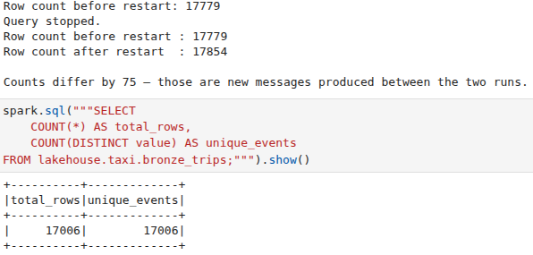

# Project 2: Streaming Lakehouse Pipeline

## 1. Medallion layer schemas

### Bronze

_Table DDL or DataFrame schema. Explain what is stored and why it is kept as-is._

**Table schema (DDL)**

```sql
CREATE TABLE lakehouse.taxi.bronze_trips (
    key STRING,
    value STRING,
    topic STRING,
    partition INT,
    offset BIGINT,
    timestamp TIMESTAMP
)
USING iceberg
```

- key: Kafka message key
- value: Raw JSON containing taxi trip data
- topic: Kafka topic name
- partition: Kafka partition ID
- offset: Message offset within the partition
- timestamp: Timestamp when the message was produced/ingested

The bronze layer is the raw ingestion layer, where data is streamed directly from Kafka and stored without modification. Data is preserved in its original form: no transformations are applied as the parsing is done in the silver layer, offsets and checkpoints allow restarts without duplication.

### Silver

_Table DDL or DataFrame schema. Explain what changed compared to bronze and why._

**Table schema (DDL)**

```sql
CREATE TABLE IF NOT EXISTS lakehouse.taxi.silver_trips (
    VendorID INT,
    tpep_pickup_datetime TIMESTAMP,
    tpep_dropoff_datetime TIMESTAMP,
    passenger_count INT,
    trip_distance DOUBLE,
    PULocationID INT,
    DOLocationID INT,
    fare_amount DOUBLE,
    total_amount DOUBLE,
    pickup_borough STRING,
    pickup_zone STRING,
    pickup_service_zone STRING,
    dropoff_borough STRING,
    dropoff_zone STRING,
    dropoff_service_zone STRING
)
USING ICEBERG
```

---

### Changes from Bronze

**1. Parsing (Raw → Structured)**
- Extracted JSON from `value` column into structured fields  
- Bronze: raw Kafka format (`key`, `value`, etc.)  
- Silver: usable columns  

**2. Type Casting**
- Converted fields to proper types (`TIMESTAMP`, `INT`, `DOUBLE`)  

**3. Data Cleaning**
- Removed rows with:
  - null timestamps or location IDs  
  - invalid duration (`dropoff <= pickup`)  
  - non-positive distance  
  - negative fare  
- Replaced `passenger_count` NULL/≤0 → `1`  
- Removed duplicates  

**4. Enrichment**
- Joined with zone lookup table:
  - `PULocationID` → pickup info  
  - `DOLocationID` → dropoff info  
- Added borough, zone, service zone  

**5. Integrity Filtering**
- Removed rows with missing zone matches  

### Gold

_Table DDL or DataFrame schema. Explain the aggregation logic._

**Table schema (DDL)**

```sql
TODO
```

## 2. Cleaning rules and enrichment

_List each cleaning rule (nulls, invalid values, deduplication key) with a brief justification._
_Describe the enrichment step (zone lookup join)._
### Cleaning Rules

- **Null handling**
  - Dropped rows with null values in:
    - `tpep_pickup_datetime`, `tpep_dropoff_datetime`
    - `PULocationID`, `DOLocationID`
  - *Justification:* These fields are required to define a valid trip

- **Passenger count normalization**
  - Replaced `NULL` or `≤ 0` with `1`
  - *Justification:* Real-world data contains invalid/missing values; prevents unnecessary data loss

- **Valid trip duration**
  - Kept only rows where `dropoff > pickup`
  - *Justification:* Ensures logical consistency of trips

- **Trip distance filter**
  - Removed rows with `trip_distance ≤ 0`
  - *Justification:* Non-positive distances are invalid

- **Fare validation**
  - Removed rows with `fare_amount < 0`
  - *Justification:* Negative fares are not realistic

- **Deduplication**
  - Applied `dropDuplicates()` on all columns
  - *Justification:* Prevents duplicate records from ingestion/streaming

---

### Enrichment

- Joined with `taxi_zone_lookup` dataset using:
  - `PULocationID → pickup zone`
  - `DOLocationID → dropoff zone`

- Added:
  - `pickup_borough`, `pickup_zone`, `pickup_service_zone`
  - `dropoff_borough`, `dropoff_zone`, `dropoff_service_zone`

- Removed rows where lookup failed (null zones)

- *Purpose:*  
  Convert location IDs into human-readable geographic information for analysis

## 3. Streaming configuration

_Describe:_
- _Checkpoint path and what it stores._
- _Trigger interval and why you chose it._
- _Output mode (append/update/complete) and why._
- _Watermark (if used) and why._

### Checkpointing

The checkpoint directory `/tmp/chk-bronze` is used by Spark Structured Streaming to store state and progress information about the streaming query.

The checkpoint contains Kafka offsets to track which messages have already been processed. It also stores commits, a record of which micro-batches have been committed to the sink for exactly-once semantics and metadata (unique query ID used to identify the query).

```python
.option("checkpointLocation", "/tmp/chk-bronze")
```

### Trigger interval

The data is processed every 5 seconds (micro-batches). An interval of 5 seconds allows near real time ingestion of messages and avoids overhead from very frequent triggers.

```python
.trigger(processingTime="5 seconds")
```

### Output mode

The append mode ensures that only new rows are added to the result table. Each message represents a new event, the data is immutable and continuously arriving.

```python
.outputMode("append")
```

### Watermarking

**PS! TODO**
Currently not used, probably needed in the gold layer where trips are aggregated over time windows. 


## 4. Gold table partitioning strategy

_Explain your partitioning choice. Why this column(s)? What query patterns does it optimize?_
_Show the Iceberg snapshot history (query output or screenshot)._

## 5. Restart proof

_Show that stopping and restarting the pipeline does not produce duplicates._
_Include row counts before and after restart._

**Bronze layer**

The bronze writing stream is run twice and the before/after row counts are compared in the notebook.



**Silver layer**

TODO

## 6. Custom scenario

_Explain and/or show how you solved the custom scenario from the GitHub issue._

## 7. How to run

```bash
# Configure credentials
cp .env.example .env

# Place data files in data/

# Start the stack
docker compose up -d

# Create the Kafka topic
docker exec kafka sh -c "/opt/kafka/bin/kafka-topics.sh \
  --bootstrap-server localhost:9092 \
  --create --topic taxi-trips --partitions 3 --replication-factor 1"

# Start the producer
docker exec project2_jupyter python /home/jovyan/project/produce.py --loop

# Run the pipeline
<your command here>
```

_Add any additional steps or dependencies needed to reproduce your results._

_Include the `.env` values the grader should use to run your project._